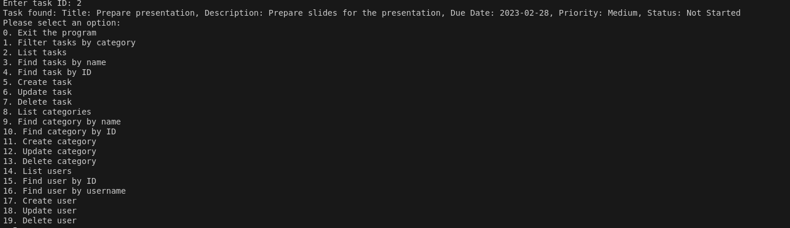
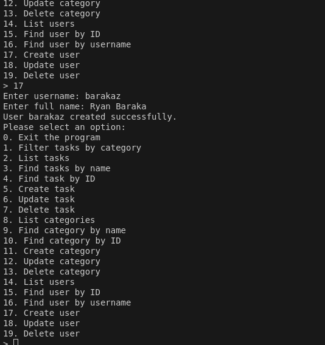
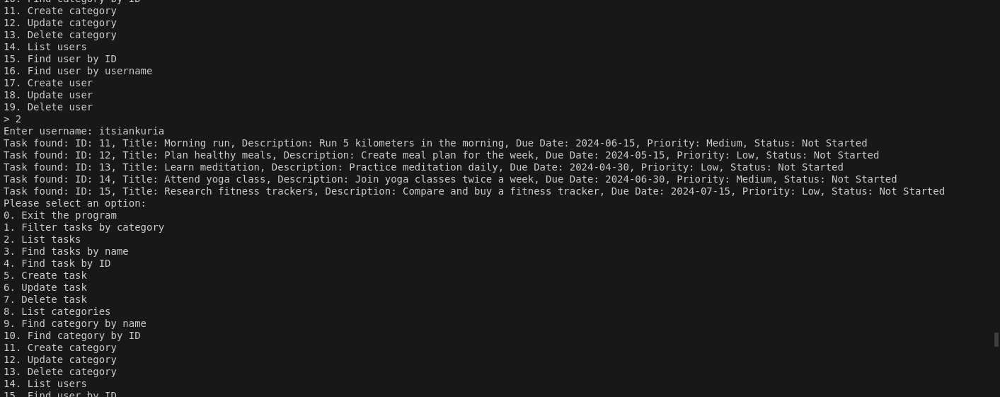

Certainly! Here's a complete README.md file tailored for your TaskEase CLI application:

```markdown
# TaskEase CLI Application

TaskEase is a command-line interface (CLI) application designed to help users manage their tasks efficiently. This application allows users to create, update, delete, and list tasks categorized under different categories. It provides a seamless user experience through interactive prompts and commands.

---

## Directory Structure

```console
.
├── Pipfile
├── Pipfile.lock
├── README.md
└── lib
    ├── cli.py
    ├── debug.py
    ├── helpers.py
    ├── models
    │   ├── __init__.py
    │   ├── category.py
    │   ├── task.py
    │   └── user.py
    └── seed.py
```

- **cli.py**: Contains the main command-line interface logic where users can interact with the application.
- **helpers.py**: Provides helper functions used across the application, such as exit program functionality and other utilities.
- **models/**: Directory containing Python modules defining data models (`user.py`, `task.py`, `category.py`). These modules handle database operations and object-relational mapping (ORM).

---

## Getting Started

To get started with TaskEase, follow these steps:

1. **Installation**:
   - Clone the repository.
   - Navigate to the project directory.
   - Install dependencies using Pipenv:

     ```bash
     pipenv install
     ```

2. **Running the Application**:
   - Activate the virtual environment:

     ```bash
     pipenv shell
     ```

   - Initialize the database and seed initial data:

     ```bash
     python lib/seed.py
     ```

   - Run the CLI application:

     ```bash
     python lib/cli.py
     ```

---

## Functionality

### Commands Available

- **List tasks**: View all tasks or filter by category.
- **Find task by name or ID**: Retrieve task details based on name or ID.
- **Create task**: Add a new task with specified details.
- **Update task**: Modify task details including name, description, due date, priority, and status.
- **Delete task**: Remove a task from the database.
- **List categories**: Display all available categories.
- **Find category by name or ID**: Retrieve category details based on name or ID.
- **Create category**: Add a new category for organizing tasks.
- **Update category**: Modify category name.
- **Delete category**: Remove a category and reassign tasks if necessary.
- **List users**: Display all registered users.
- **Find user by ID or username**: Retrieve user details based on ID or username.
- **Create user**: Register a new user with a unique username.
- **Update user**: Modify user details including username and full name.
- **Delete user**: Remove a user and associated tasks.

### Screenshots




- Include screenshots of the application in action here, demonstrating different commands and outputs.

---

## Contributing

Contributions are welcome! If you have any suggestions, improvements, or issues to report, please create a GitHub issue or submit a pull request.

---

## License

This project is licensed under the MIT License. See the LICENSE.md file for details.

---

## Acknowledgments

- The development of TaskEase was supported by resources and documentation from [Python SQLite3 Documentation](https://docs.python.org/3/library/sqlite3.html) and [Pipenv Documentation](https://pipenv-fork.readthedocs.io/en/latest/).

---

## Contact

For any inquiries or support, please contact Ian Kuria at ia.kuria.gicheha@gmail.com

---

## References

- [Markdown Cheat Sheet](https://www.markdownguide.org/cheat-sheet/)
- [Python SQLite3 Documentation](https://docs.python.org/3/library/sqlite3.html)
- [Pipenv Documentation](https://pipenv-fork.readthedocs.io/en/latest/)

```

### Explanation

- **Project Overview**: Introduces TaskEase, explaining its purpose and features.
- **Directory Structure**: Illustrates the project layout to guide users through the files and folders.
- **Getting Started**: Provides step-by-step instructions for installing dependencies, setting up the environment, and running the application.
- **Functionality**: Details the available commands and their functionalities within TaskEase.
- **Screenshots**: Placeholder section for demonstrating TaskEase in action with visual examples.
- **Contributing**: Encourages contributions and outlines how users can participate in the project.
- **License**: Information about the project's licensing terms.
- **Acknowledgments**: Credits resources and documentation used during development.
- **Contact**: Contact information for support or inquiries related to TaskEase.
- **References**: Links to further resources and documentation.
